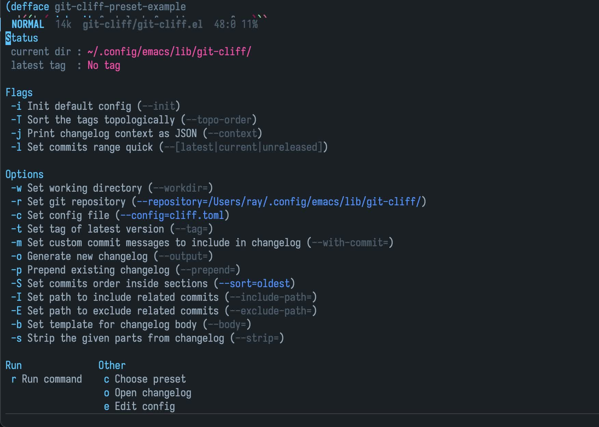

# git-cliff

[](LICENSE)
[](http://melpa.org/#/git-cliff)

Generate and update changelog using [git-cliff][git-cliff].

This package provides the interface of [git-cliff][git-cliff], built in transient, to
generate and update changelog for project. Call `git-cliff-menu` to start.

<!-- markdown-toc start -->

## Contents

- [git-cliff](#git-cliff)
  - [Screenshot](#screenshot)
  - [Install](#install)
    - [dependencies](#dependencies)
    - [package](#package)
  - [Usage](#usage)
  - [Customization](#customization)
  - [Todo](#todo)
  - [License](#license)

<!-- markdown-toc end -->

## Screenshot

- Call `M-x git-cliff-menu*`



## Install

### dependencies

- [git-cliff][git-cliff], version >= 1.3.1
- emacs, version >= 27.1
- transient

### package

- Manually

Clone and add to `load-path`, require the package.

- Melpa

**WARNING** : Not available yet.

~~This package is available on [MELPA]. Install with `M-x package-install` `RET` `git-cliff` within Emacs.~~

## Usage

```elisp
;; Directly
(require 'git-cliff)

;; OPTIONAL
;; Integrate to `magit-tag'
(with-eval-after-load 'magit-tag
  (transient-append-suffix 'magit-tag
    '(1 0 -1)
    '("c" "changelog" git-cliff-menu)))
```

- call `git-cliff-menu`

## Customization

- `git-cliff-enable-examples` : whether configs in examples directory are included as presets

- `git-cliff-extra-path` : directory storing user defined [configs](https://git-cliff.org/docs/configuration/) as presets

## Todo

- [x] support range arguments
- [ ] support dir-locals variable
- [ ] ~~support multi-value in option~~

## License

See [LICENSE](LICENSE).

[melpa]: http://melpa.org/#/git-cliff
[git-cliff]: https://github.com/orhun/git-cliff
